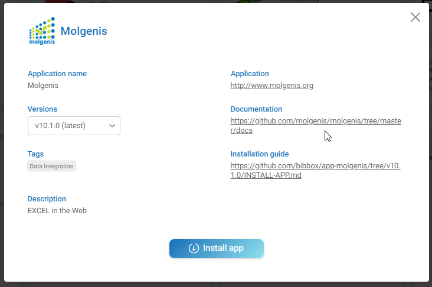
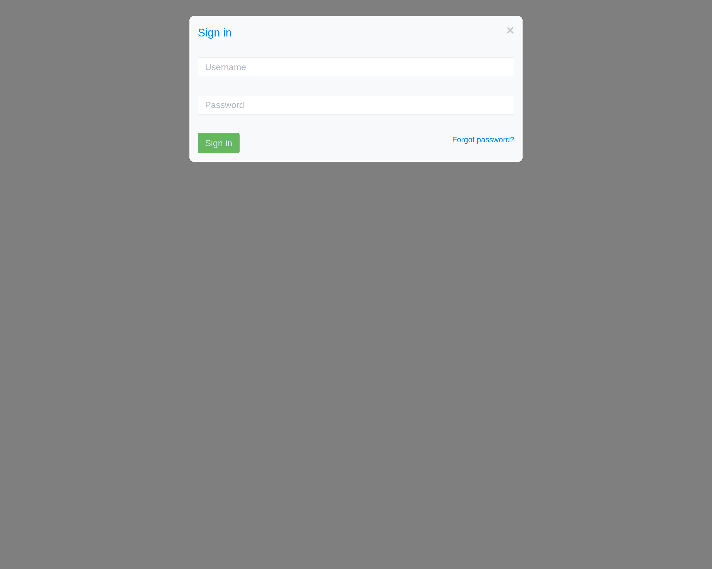
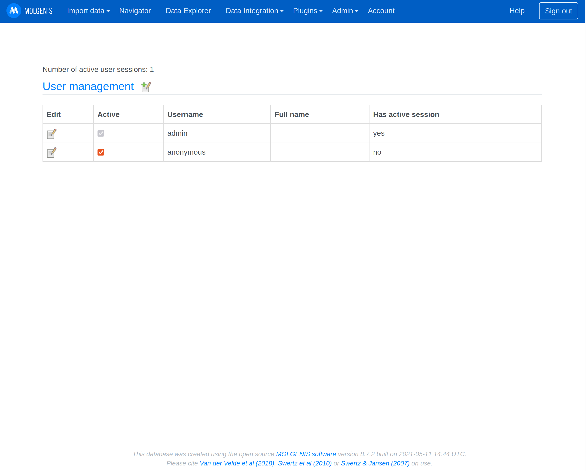
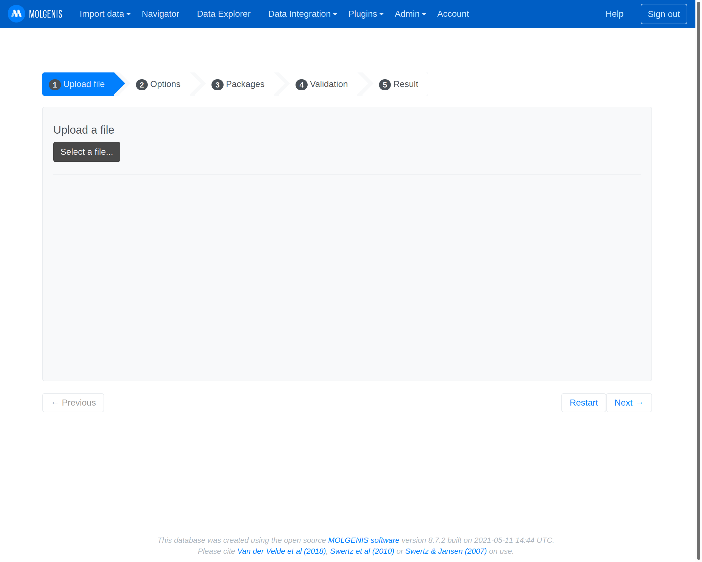
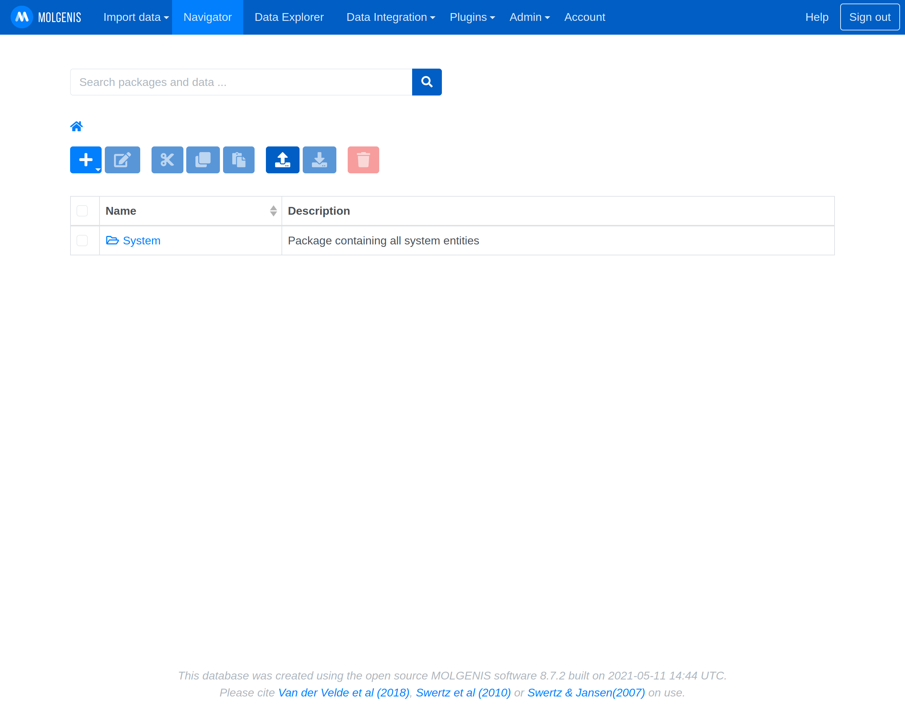

# Molgenis Installation Instructions 
 
The application can be installed either within the BIBBOX environment or as a stand-alone solution. Installation instructions can be found within the BIBBOX, followed by setup instructions required once the application has been successfully installed.

## Installation within in the BIBBOX

Once you've selected the desired App for your BIBBOX instance, you can choose from the available versions, as shown in the following figure.

Clicking "Install App" will open a new window, as illustrated in the following figure. Here, you can define the necessary entries. Some fields come pre-filled with suggested options, and if left unchanged, these default values will be used as the entries.

After confirming by clicking "Install," the App will be installed as a BIBBOX instance. Once the installation is complete, you only need to follow a few steps to use the App for the first time, which are described below.

## Setup after BIBBOX or stand-alone installation

Be patient this can take up to 5 minutes (its a huge App). The last message in the log should be something like this

`17-Sep-2021 07:24:16.134 INFO [main] org.apache.catalina.startup.HostConfig.deployDirectory Deploying web application directory [/usr/local/tomcat/webapps/ROOT]`

### Log in with the username admin and the password you specified in the installation. 
The default admin user name is "admin". The admin password is "admin",too. So please change these settings after your first login.

### Make all further configuration steps within the Molgenis app.
Further information can be found here https://molgenis.org/ and https://molgenis.gitbook.io/molgenis/.

#### Add and manage user permissions in the Admin/User Manager Menu.

#### Upload your data using the Molgenis EMX format.
Other fromats like `.csv` and `.vcf` are also supported and can be nativly uploaded.

#### Navigate through your data using the Navigator.

## After the installation
Have a nice ride with the Admins youngtimer.

